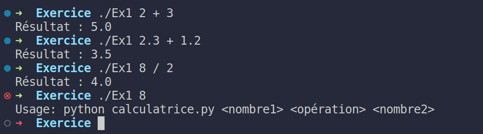
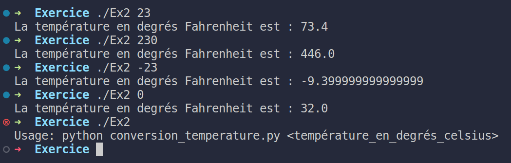
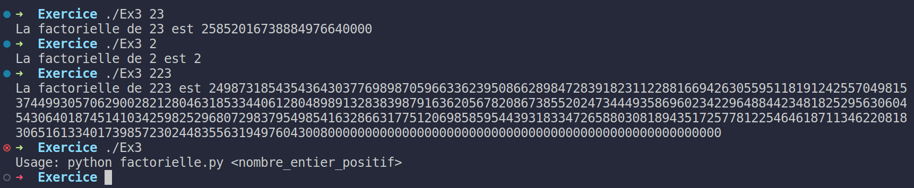
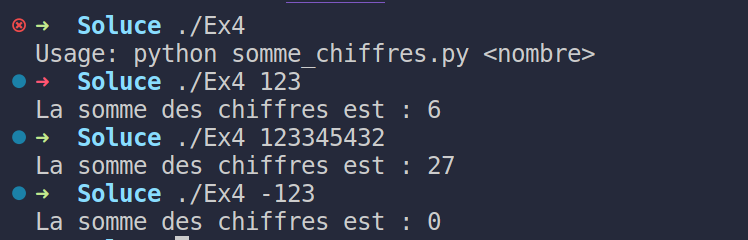
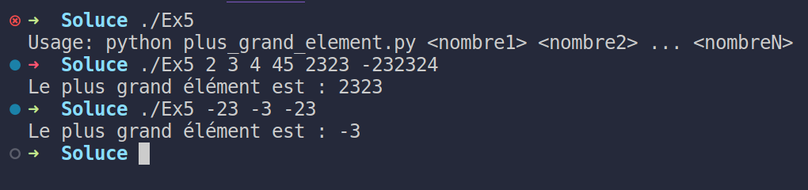
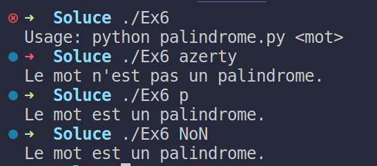
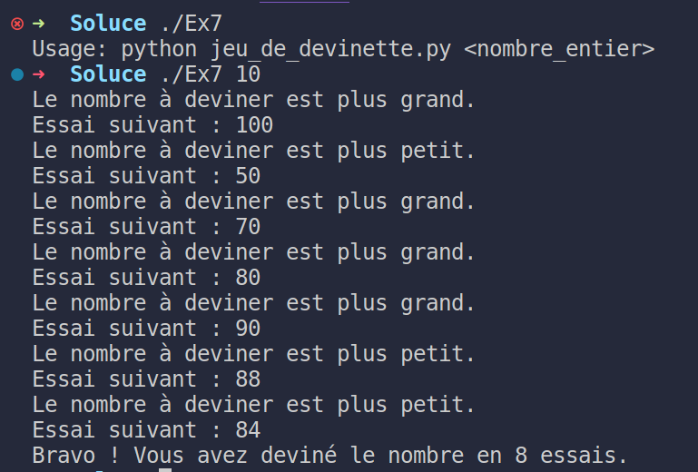

# Workshop d'Initiation à Python

Bienvenue dans le workshop d'initiation à Python ! Ce workshop est conçu pour les débutants qui souhaitent apprendre les bases de la programmation en Python.

## Objectifs du Workshop

- Comprendre les fondamentaux de la programmation en Python.
- Apprendre à manipuler des données avec Python.

## Prérequis d'Installation

Avant de commencer le workshop, assurez-vous de disposer des éléments suivants installés sur votre ordinateur :

1. **Python :** Vous avez besoin de Python installé. Vous pouvez télécharger Python depuis [le site officiel](https://www.python.org/downloads/). Le workshop a été conçu avec Python 3.x en tête.

2. **Environnement de Développement :** Nous vous recommandons d'utiliser un environnement de développement Python, tel que Jupyter Notebook ou Google Colab. Vous pouvez installer Jupyter Notebook en utilisant `pip` : `pip install notebook`.

## Contenu du Workshop

Le workshop se compose de plusieurs exercices progressifs, couvrant les sujets suivants :

1. Calculatrice basique en Python.


2. Conversion de température (Celsius en Fahrenheit).


3. Calcul de la factorielle d'un nombre.


4. Calcul de la somme des chiffres d'un nombre.


5. Recherche du plus grand élément dans une liste.


6. Vérification de palindromes.


7. Création d'un jeu de devinette en Python.


## Comment Utiliser ce Dépôt

1. Clonez ce dépôt sur votre ordinateur en utilisant la commande Git :
   ```shell
   git clone https://github.com/votre-utilisateur/nom-du-depot.git
